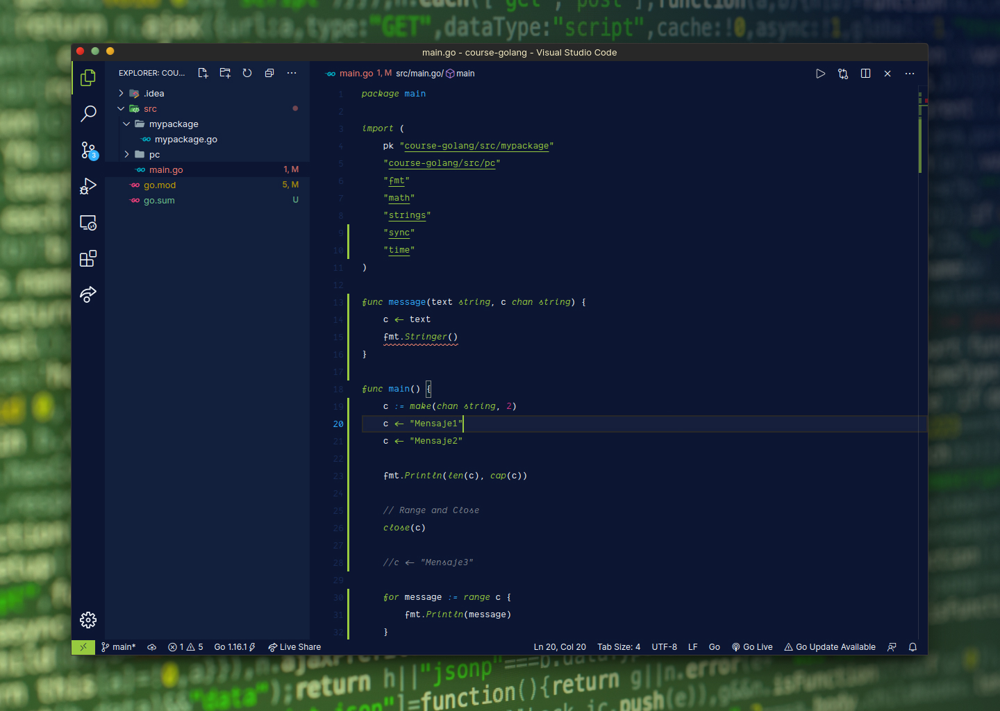

<h1 align="center">🧑‍🎨 Platzi Theme 🧑‍💻</h1>

## How install?
Actually the theme is no longer for vs code marketplace download, I'm working on that 😉.

### Steps 🐾
1. Clone this repository into your visual studio code extensions folder
Linux and MacOs: `$HOME/.vscode/extensions/`
Windows: C:{your user name}.vscode/extensions/`.
2. Reopen Visual Studio Code
3. `Control + Shift + P` and write "Preferences: Color Theme" and search the theme.
4. Enjoy and happy hacking!!!
